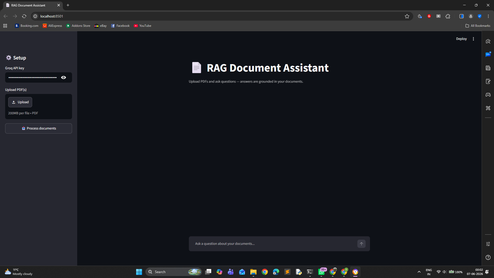
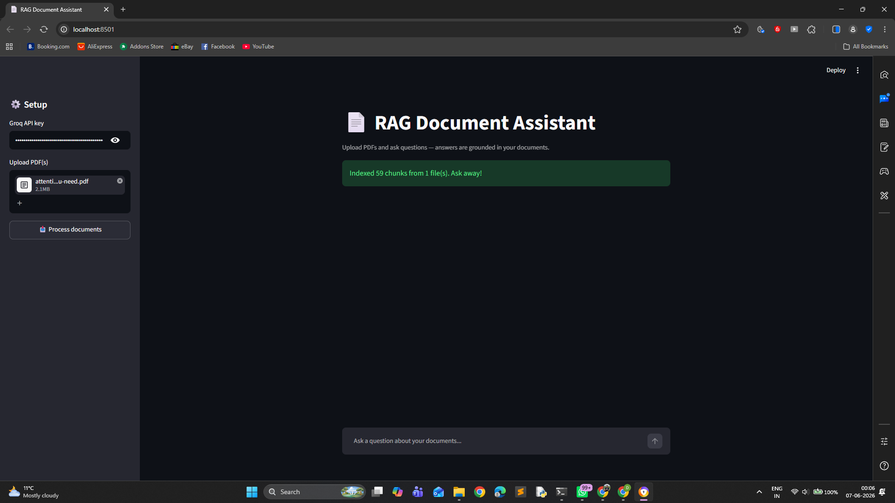
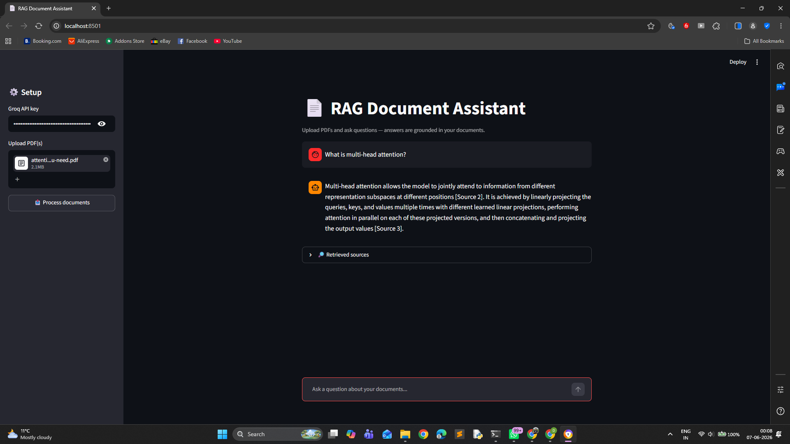
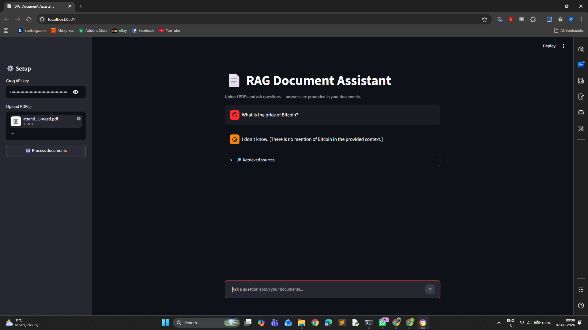

# 📄 RAG-Powered Document Assistant

An AI assistant that lets you **upload PDF documents and ask questions about them in plain English**. Instead of guessing, the model answers using *your* documents — a technique called **Retrieval-Augmented Generation (RAG)**.

> Upload a PDF → ask "What were the key findings?" → get a cited, grounded answer.

  

## ✨ Features
- 📥 Upload one or more PDFs
- 🔍 Semantic **vector search** over document chunks (sentence-transformers embeddings)
- 🤖 **Grounded answers** generated by an LLM, with source citations
- 🛡️ Says *"I don't know"* when the answer isn't in the documents (reduces hallucination)
- 💬 Clean chat-style UI built with Streamlit

## 🏗️ How it works (the RAG pipeline)
```
PDF → text extraction → chunking → embeddings → vector similarity search → LLM → cited answer
```
1. **Extract** text from the PDFs (`pypdf`)
2. **Chunk** it into overlapping passages
3. **Embed** each chunk into a vector (`all-MiniLM-L6-v2`)
4. **Retrieve** the top-k most relevant chunks for a question (cosine similarity)
5. **Generate** an answer with the LLM, grounded only in those chunks

## 📸 Screenshots

Captured from a real run against the example paper ([Attention Is All You Need](examples/)).

| | |
|---|---|
| **Landing** — clean empty state | **Indexed** — 59 chunks from the paper |
|  |  |
| **Grounded answer** — cites its sources | **"I don't know"** — refuses out-of-context questions |
|  |  |

## 🚀 Quick start
```bash
# 1. Install dependencies
pip install -r requirements.txt

# 2. Run the app
streamlit run app.py
```
Then in the sidebar: paste your **Groq API key**, upload a PDF, click **Process documents**, and start asking questions.

> Get a **free** key at https://console.groq.com (no credit card required).

Need a document to try it with? Download the real public example (the Transformer
paper) — see [`examples/`](examples/):

```bash
python examples/download_example.py
```

## 🧰 Tech stack
| Layer | Tool |
|-------|------|
| UI | Streamlit |
| PDF parsing | pypdf |
| Embeddings | sentence-transformers (`all-MiniLM-L6-v2`) |
| Vector search | NumPy cosine similarity |
| LLM | Groq (`llama-3.3-70b-versatile`) |

## 🌐 Deploy it (free)
Push this repo to GitHub, then deploy on **[Streamlit Community Cloud](https://streamlit.io/cloud)** in a few clicks so anyone (recruiters!) can try it live.

## 🔭 Possible extensions
- Swap NumPy search for a real vector DB (**ChromaDB / FAISS**)
- Add support for `.docx`, `.txt`, and web pages
- Conversation memory for multi-turn follow-ups
- Use a local open-source LLM (Ollama) for fully offline use

---
**Author:** Abin Oommen Thomas — Graduate AI Engineer / Data Scientist
