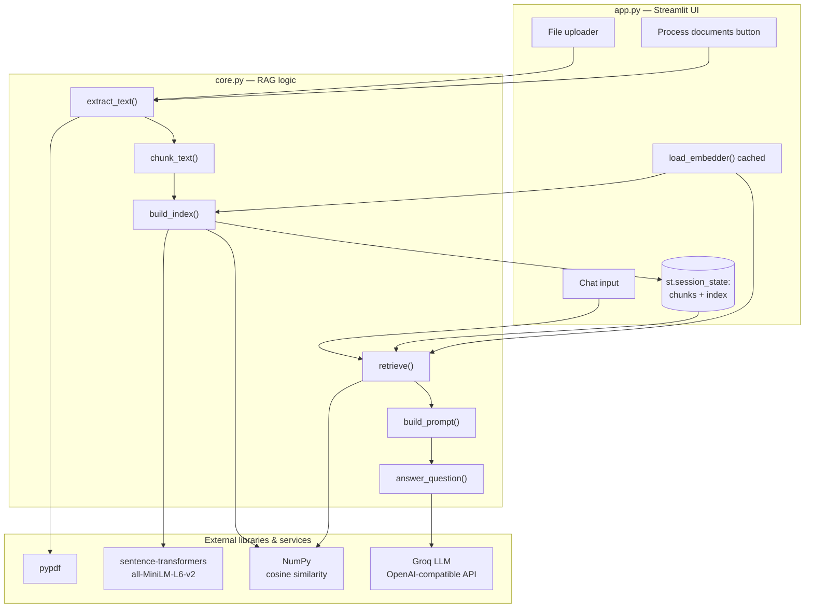
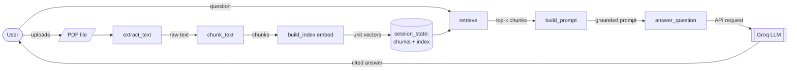
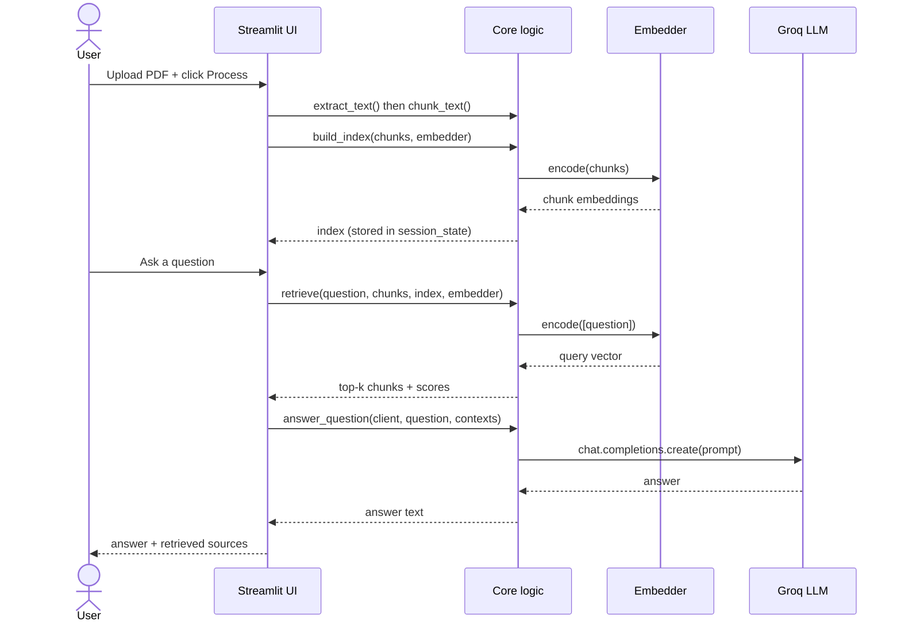

# Architecture

Diagrams for the RAG Document Assistant, derived directly from the code
(`app.py` and `core.py`). They render natively on GitHub.

There is **no entity-relationship diagram**: the app holds no database — indexed
chunks and their embeddings live only in Streamlit's per-session state.

---

## 1. Component architecture

How the UI layer, the core logic, and external libraries/services fit together.

---

## 2. Data-flow diagram (DFD)

How a document and a question flow through the system.

---

## 3. Sequence — asking a question

The request lifecycle from upload to a grounded, cited answer.

